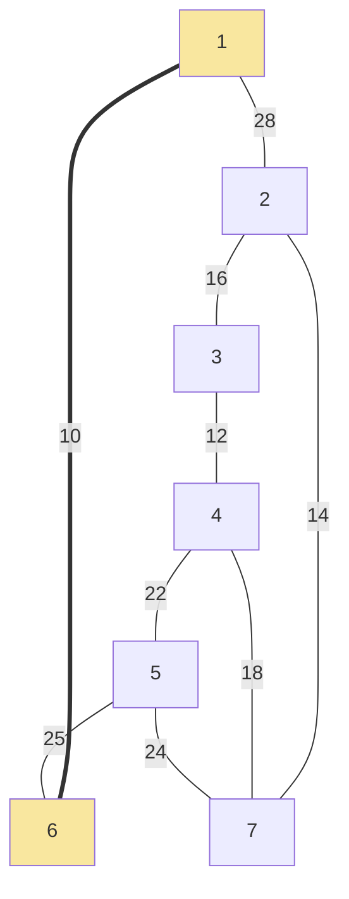
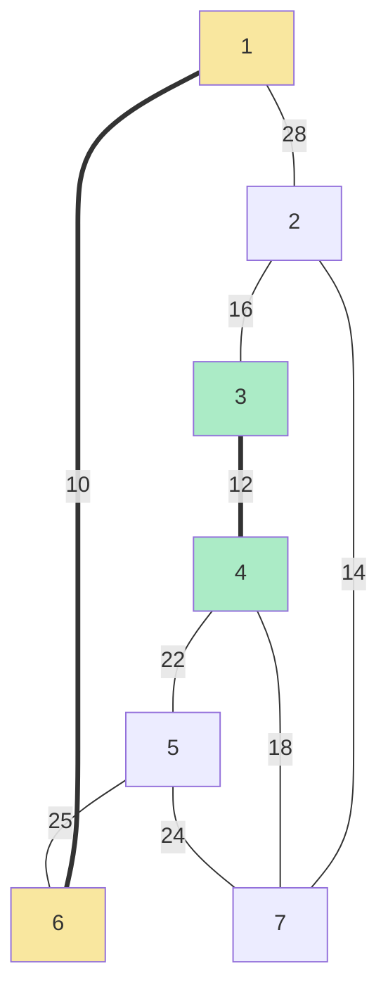
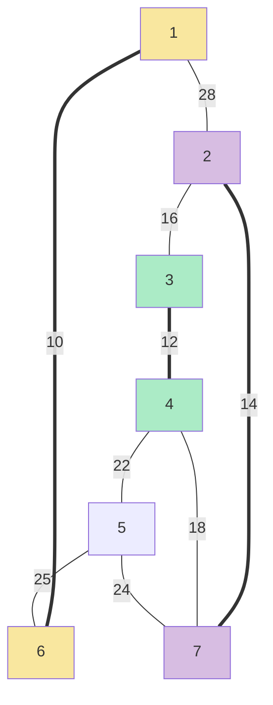
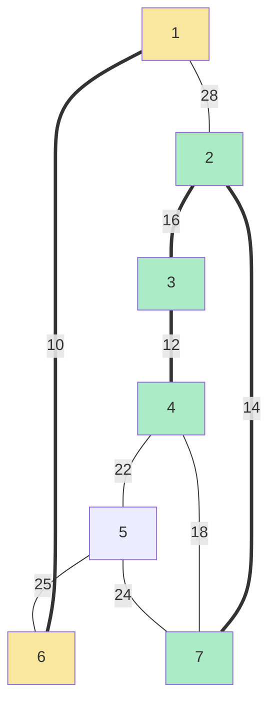
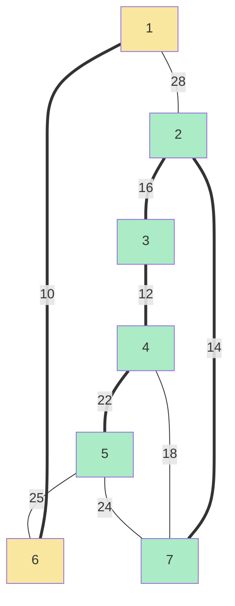
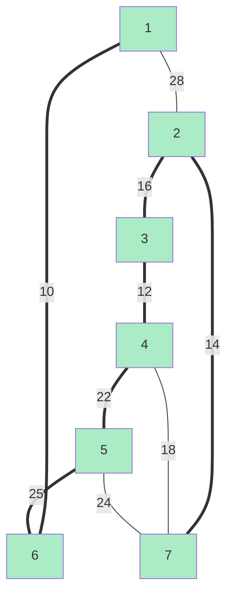

# Kruskal's Algorithm - Step-by-Step Execution

**Graph Details:**
* **Nodes:** 7 (Numbered 1 to 7)
* **Algorithm behavior:** 
    1. Sort all edges from cheapest to most expensive.
    2. Pick the cheapest edge.
    3. If adding the edge creates a **cycle**, discard it.
    4. Repeat until you have $(n-1)$ edges.

---

### Step 0: Sort All Edges
| Edge | Weight | Status |
| :--- | :--- | :--- |
| **1-6** | **10** | Pending |
| **3-4** | **12** | Pending |
| **2-7** | **14** | Pending |
| **2-3** | **16** | Pending |
| **4-7** | **18** | Pending |
| **4-5** | **22** | Pending |
| **5-7** | **24** | Pending |
| **5-6** | **25** | Pending |
| **1-2** | **28** | Pending |

---

### Step 1: Pick Edge 1-6 (10)
* **Action:** Smallest edge in the whole graph. 
* **Cycle Check:** No cycle. **Accept.**

---

### Step 2: Pick Edge 3-4 (12)
* **Action:** Next smallest. 
* **Cycle Check:** Nodes 3 and 4 are not connected. **Accept.**

---

### Step 3: Pick Edge 2-7 (14)
* **Action:** Next smallest.
* **Cycle Check:** Nodes 2 and 7 are not connected. **Accept.**

---

### Step 4: Pick Edge 2-3 (16)
* **Action:** Connects the "2-7" group with the "3-4" group.
* **Cycle Check:** No cycle. **Accept.**

---

### Step 5: Pick Edge 4-7 (18)
* **Action:** Next smallest weight is 18.
* **Cycle Check:** Node 4 and Node 7 are **already connected** via 4-3-2-7.
* **Result:** ❌ **REJECTED** (Adding this would create a cycle).

---

### Step 6: Pick Edge 4-5 (22)
* **Action:** Next smallest.
* **Cycle Check:** Node 5 is not yet in the main tree. **Accept.**

---

### Step 7: Pick Edge 5-7 (24)
* **Action:** Next smallest weight is 24.
* **Cycle Check:** Node 5 and 7 are **already connected** via 5-4-3-2-7.
* **Result:** ❌ **REJECTED** (Forms a cycle).

---

### Step 8: Pick Edge 5-6 (25)
* **Action:** Connects the "1-6" group with the "2-3-4-5-7" group.
* **Cycle Check:** No cycle. **Accept.**

---

### Final Result
We have picked $(7 - 1) = 6$ edges. The algorithm stops. 

**Accepted Edges (Kruskal's Order):**
1. `1 -- 6` (10)
2. `3 -- 4` (12)
3. `2 -- 7` (14)
4. `2 -- 3` (16)
5. `4 -- 5` (22)
6. `5 -- 6` (25)

**Total Weight:** 10 + 12 + 14 + 16 + 22 + 25 = **99**

*(Notice: The final edges and total weight are identical to Prim's, but they were picked in a totally different order!)*