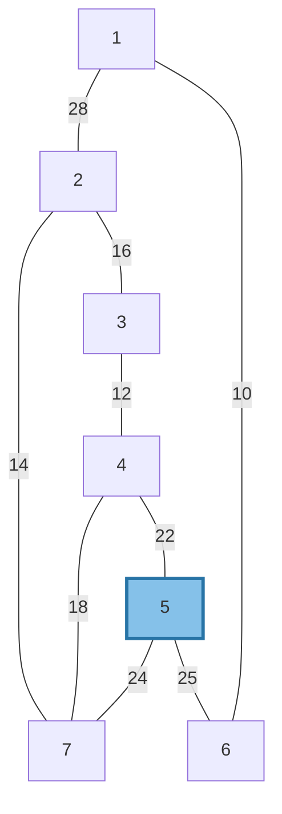
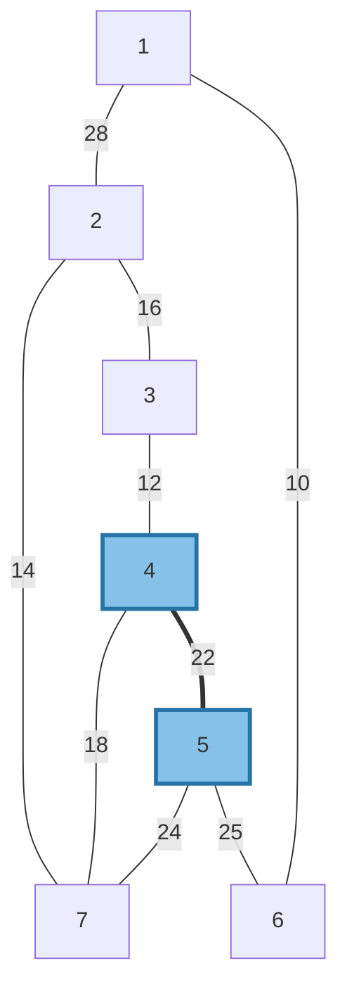
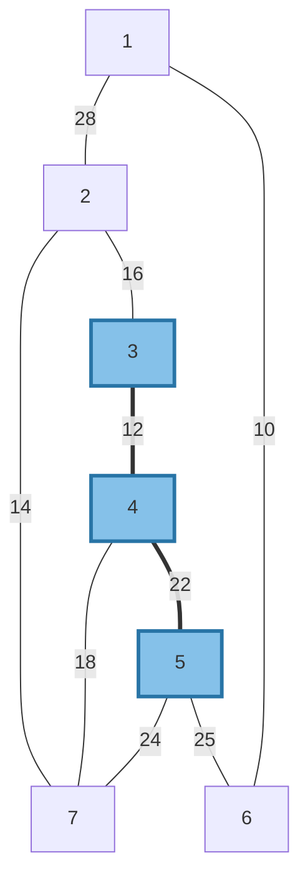
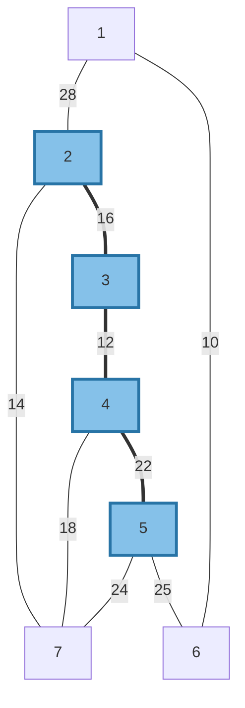
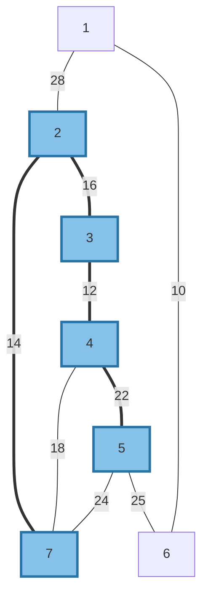
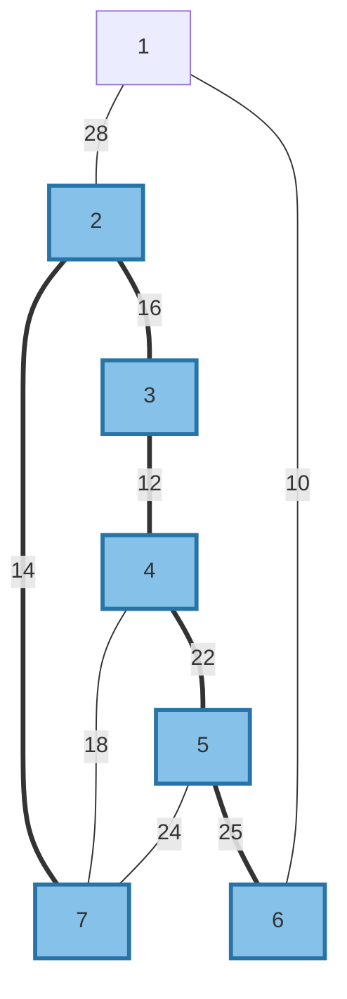
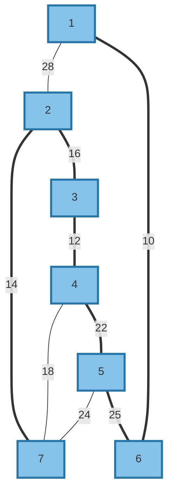

# Prim's Algorithm - Step-by-Step Execution

**Graph Details:**
* **Nodes:** 7 (Numbered 1 to 7)
* **Starting Node:** 5
* **Algorithm behavior:** At each step, the algorithm picks the cheapest available edge that connects a new node to the growing Minimum Spanning Tree (MST).

---

### Initial State
* **MST Contains:** `{5}`
* **Keys Array (Cheapest ticket to MST):** 
  * Node 5 is `0` (Starting node)
  * All others are `∞` (Infinity)

* **Action:** Node 5 looks at its neighbors (4, 6, 7). 
* **Updates:** 
  * Node 4 key updated to `22`
  * Node 6 key updated to `25`
  * Node 7 key updated to `24`

---

### Step 1: Picking Node 4
* **Available Keys:** [Node 4: `22`], [Node 7: `24`], [Node 6: `25`].
* **Action:** Node 4 has the cheapest key (`22`). We pull Node 4 into the MST using edge **5->4**.
* **MST Contains:** `{5, 4}`

* **Updates from Node 4:**
  * Node 3 key updated to `12`.
  * Node 7 is currently `24` (via Node 5), but Node 4 connects to it for `18`. **Update Node 7 key to `18`!**

---

### Step 2: Picking Node 3
* **Available Keys:** [Node 3: `12`], [Node 7: `18`], [Node 6: `25`].
* **Action:** Node 3 has the cheapest key (`12`). We pull Node 3 into the MST using edge **4->3**.
* **MST Contains:** `{5, 4, 3}`

* **Updates from Node 3:**
  * Node 2 key updated to `16`.

---

### Step 3: Picking Node 2
* **Available Keys:** [Node 2: `16`], [Node 7: `18`], [Node 6: `25`].
* **Action:** Node 2 has the cheapest key (`16`). We pull Node 2 into the MST using edge **3->2**.
* **MST Contains:** `{5, 4, 3, 2}`

* **Updates from Node 2:**
  * Node 1 key updated to `28`.
  * Node 7 is currently `18` (via Node 4), but Node 2 connects to it for `14`. **Update Node 7 key to `14`!**

---

### Step 4: Picking Node 7
* **Available Keys:** [Node 7: `14`], [Node 6: `25`], [Node 1: `28`].
* **Action:** Node 7 has the cheapest key (`14`). We pull Node 7 into the MST using edge **2->7**.
* **MST Contains:** `{5, 4, 3, 2, 7}`

* **Updates from Node 7:** 
  * None. All its neighbors are already in the MST!

---

### Step 5: Picking Node 6
* **Available Keys:** [Node 6: `25`], [Node 1: `28`].
* **Action:** Node 6 has the cheapest key (`25`). We pull Node 6 into the MST using edge **5->6**.
* **MST Contains:** `{5, 4, 3, 2, 7, 6}`

* **Updates from Node 6:**
  * Node 1 is currently `28` (via Node 2), but Node 6 connects to it for `10`. **Update Node 1 key to `10`!**

---

### Step 6: Picking Node 1 (Final Step)
* **Available Keys:** [Node 1: `10`].
* **Action:** Node 1 has the cheapest key (`10`). We pull Node 1 into the MST using edge **6->1**.
* **MST Contains:** `{5, 4, 3, 2, 7, 6, 1}`

### Final Result
All 7 nodes are now in the Minimum Spanning Tree. The loop terminates. 

**Chronological Edge Log:**
1. `5 -> 4` (Weight: 22)
2. `4 -> 3` (Weight: 12)
3. `3 -> 2` (Weight: 16)
4. `2 -> 7` (Weight: 14)
5. `5 -> 6` (Weight: 25)
6. `6 -> 1` (Weight: 10)

**Total Minimum Spanning Tree Weight:** `99`